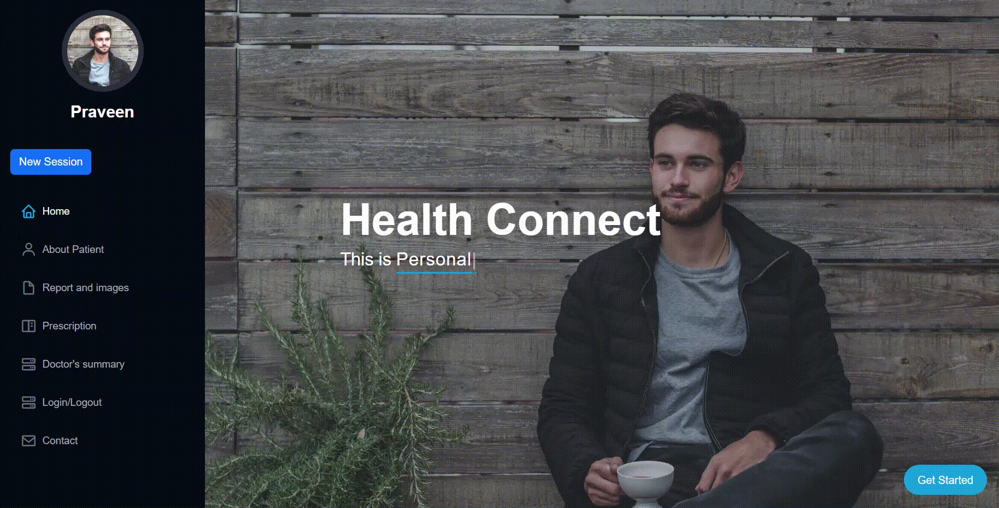
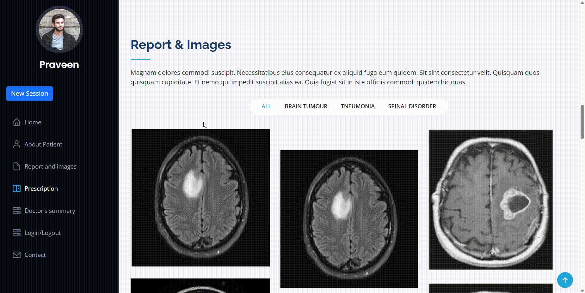

# The Healthcare Management System Using AI 
# ( HEALTH CONNECT )

## Project Overview 🚀
The primary objective of HEALTH CONNECT is to revolutionize healthcare management by shifting from traditional paper-based and offline processes to a modern, fully digital, and paperless system.

The project aims to streamline medical record management and enhance doctor-patient interactions using OCR, image analysis, and classification. It involves converting medical records into searchable PDFs, analyzing medical images, facilitating symptom-based document retrieval, transcribing and summarizing conversations, and generating prescription QR codes.

### Bridging the Gap Between Healthcare and Technology
Historically, the healthcare industry has been reliant on paper records and face-to-face interactions. However, HEALTH CONNECT challenges this conventional approach by harnessing the power of cutting-edge technologies. The project leverages Optical Character Recognition (OCR), image analysis, classification techniques, and AI-driven automation to address critical aspects of healthcare management.

### Key Objectives
- **OCR Conversion:** One of the core functions of HEALTH CONNECT is to convert conventional medical records into easily searchable PDFs using advanced OCR technology. This digitization process enables healthcare professionals to access patient information rapidly and efficiently.

- **Image Analysis and Classification:** The project incorporates state-of-the-art image analysis and classification techniques to diagnose medical conditions from images. From identifying fractures to detecting cancer, HEALTH CONNECT empowers medical practitioners with enhanced diagnostic capabilities.

- **Symptom-based Document Retrieval:** HEALTH CONNECT introduces an innovative approach to document retrieval. Nurses and healthcare providers can utilize patient symptoms as search keywords to retrieve relevant OCR'd documents. This feature significantly aids doctors in the diagnostic process.

- **Doctor's Interface:** To facilitate informed decision-making during patient consultations, HEALTH CONNECT offers a user-friendly interface for doctors. It presents OCR'd medical records and the results of image analysis in a comprehensible manner.

- **Transcription and Summarization:** Large Language Models (LLMs) are employed to transcribe and summarize doctor-patient conversations efficiently. This feature simplifies the review process and ensures that essential information is readily accessible.

- **QR Code Prescription:** HEALTH CONNECT goes beyond conventional prescription methods. It generates QR codes for prescribed medications, simplifying the medication fulfillment process for patients and pharmacies.

This project represents more than just a technological innovation; it signifies a paradigm shift in healthcare management. HEALTH CONNECT aims to make healthcare more efficient, accessible, and patient-centric, setting the stage for a future where the healthcare industry embraces the digital age.

## Scope and Focus of the Project 🎯

It's important to note that, given the constraints of the 48-hour hackathon, our project represents a proof of concept and a focused exploration of AI solutions within the healthcare domain. The comprehensive scope of a full-fledged healthcare management system is vast and multifaceted. Therefore, our primary objectives for this hackathon were as follows:

### 1. Proof of Concept:
Our aim was to establish the feasibility of integrating AI technologies to address key challenges in healthcare management. We focused on demonstrating the potential of AI in specific areas, such as medical record management, image analysis, and transcription.

### 2. Research-Driven Solutions:
We emphasized rigorous research to identify practical and impactful solutions. Our project leverages state-of-the-art AI techniques while acknowledging the need for further development and refinement.

### 3. Practical and Achievable Solutions:
Given the time limitations of the hackathon, we prioritized solutions that could be implemented and tested within the scope of this event. This allowed us to showcase the application of AI in real-world healthcare scenarios.

### 4. Technical Exploration:
We explored a diverse tech stack, including Python, TensorFlow, PyTorch, and various libraries. Our goal was to gain technical insights and understanding while implementing AI-driven features.

In summary, this project represents a focused and technically-driven exploration of AI solutions in healthcare. While we recognize the immense potential for expanding these concepts into a full healthcare management system, our efforts during the hackathon were geared towards establishing a strong foundation for future development and innovation in this critical domain.

## Tech Stack 💻

Here are the technologies and tools we used to build our AI solution:

* **HTML** 
* **CSS** 
* **Python** 
* **TensorFlow** 
* **PyTorch** 
* **Pandas** 
* **OpenCV** 
* **Librosa** 
* **NLTK** 
* **Transformers** 
* **Pytorch** 
* [More technologies/tools used]

## Project Features and Functionality ✨
- OCR Conversion: Convert medical records PDFs into searchable PDFs using Optical Character Recognition (OCR) technology.
- Image Analysis and Classification: Analyze medical images to classify conditions such as fractures and cancer using image analysis and classification techniques.
- Symptom-based Document Retrieval: Nurses use patient symptoms as keywords to search for relevant OCR'd documents, aiding doctors in diagnosis.
- Doctor's Interface: Present OCR'd records and image analysis results to doctors for informed decision-making during patient consultations.
- Transcription and Summarization: Utilize Large Language Models (LLMs) to transcribe and summarize doctor-patient conversations, facilitating efficient review.
- QR Code Prescription: Generate QR codes for prescribed medications, enabling easy scanning at pharmacies for medication fulfillment.

## How It Works 🛠️
Provide a high-level overview of how our AI solution works. You can use diagrams or flowcharts to make it easier to understand. Explain the key components, data flow, and the AI/ML techniques utilized.

## Challenges and Solutions 🧠
* Audio Separation and Deep Clustering: Initially, the project aimed to separate doctor-patient audio using spectrogram and deep clustering methods. However, due to complexity and resource limitations, implementing this in-house proved challenging.

Solution: As an alternative, an external API specializing in audio separation was integrated to achieve accurate separation of doctor-patient conversations.

## Future Enhancements 🚧
* Blockchain Integration: Enhance data security and integrity by incorporating blockchain technology to create an immutable and tamper-proof audit trail for medical records.
* Real-time Collaboration: Enable real-time collaboration between doctors, nurses, and patients by integrating chat and video features into the platform.
* Predictive Analytics: Implement predictive analytics to assist doctors in making proactive treatment recommendations based on historical patient data.
* Integration with EHR Systems: Integrate with Electronic Health Record (EHR) systems to streamline data sharing and improve the overall healthcare ecosystem.

## Screenshots and Demos 📸
Showcase the visual aspects of our AI solution through screenshots or videos. If possible, include a link to a live demo or video demonstration.

